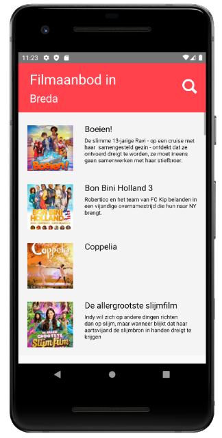

<strong>Cinema Checker</strong>

 

React Native application fetching RSS data from biosagenda to display current movies in your area

 

 
## Quick start

 Android and iOS runnning is different. So that follow the steps below.
    - For iOS `cd ios` and run `pod install`. Go to directory '`cd ..`' and run `react-native run-ios`
    - For Android `react-native run-android`.
